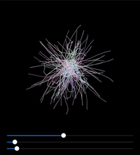

# Art-in-Swift
A collection of interactive animations made with code in Swift Playgrounds app

    
    
    
    
    
                                                                                                                                         

                                                                                                                                       
Click on images to see the code :point_down:   

#### Squid Game (particles moving in fields shaped by SDFs)

   <a href="https://github.com/gadirom/Art-in-Swift/blob/main/Squid Game SDF.swift">

     

#### Worms (via Core Graphics)

   <a href="https://github.com/gadirom/Art-in-Swift/blob/main/Worms.swift">

     

#### Ray Marching Blending Matcaps (with Metal shader inside a SwiftUI view)

   <a href="https://github.com/gadirom/Art-in-Swift/blob/main/Raymarching%20Blending%20Matcaps.swift">

     
    
#### Ray Marching Mixing Colors (with Metal shader inside a SwiftUI view)

   <a href="https://github.com/gadirom/Art-in-Swift/blob/main/Ray%20Marching%20Mixing.swift">

      
    
#### Ray Marching Toggle (with Metal shader inside a SwiftUI view)

   <a href="https://github.com/gadirom/Art-in-Swift/blob/main/Ray%20Marching%20Toggle.swift">

      
    
#### Button on Ropes (physics simulation in real time in SwiftUI view)

   <a href="https://github.com/gadirom/Art-in-Swift/blob/main/Button%20on%20Ropes.swift">

      
    
#### Crashing Buttons in SwiftUI

   <a href="https://github.com/gadirom/Art-in-Swift/blob/main/Crashing%20Button.swift">

      
    
#### Hexagons and Pendulums

   <a href="https://github.com/gadirom/Art-in-Swift/blob/main/Hexagon%20Pendulums.swift">

   
