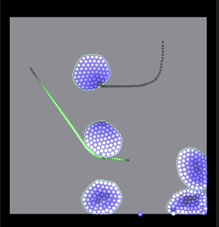

# Verlet Engine

   

     

This is a little app that you can open in Swift Playgrounds on an iPad.

It uses two of my open source packages:
- [MetalBuilder](https://github.com/gadirom/MetalBuilder) - for simulation and rendering
- [TransfomrGesture](https://github.com/gadirom/TransfomrGesture) - for supporting two finger gestures

To run on iPad download the whole repository [Art-in-Swift](https://github.com/gadirom/Art-in-Swift) (Code->Download ZIP), run Files and unzip, then open this package (Verlet Engine).
